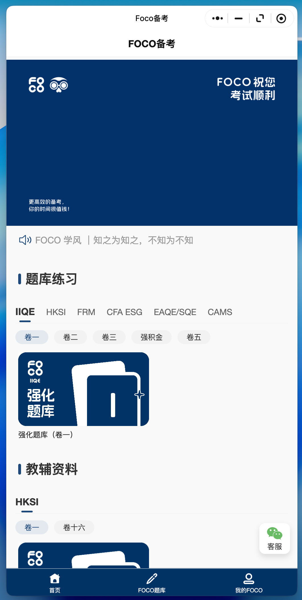
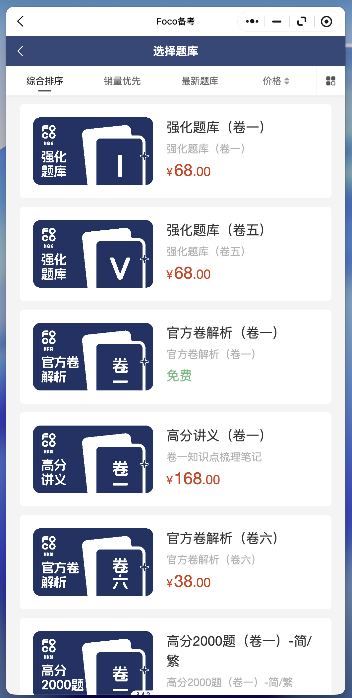

# 守正题库

微信小程序刷题考试平台，包含用户端小程序和管理后台。

<p align="center">
  
  
  
</p>

## 功能

- **题库管理** — 多级分类：分类 → 题库 → 版本 → 章节 → 题目
- **多种练习模式** — 顺序练习、随机练习、章节练习、错题集
- **模拟考试** — 限时交卷、自动评分
- **收藏与笔记** — 收藏题目、记录笔记
- **学习统计** — 练习历史、学习轨迹
- **支付体系** — 钱包、激活码、微信支付
- **管理后台** — 题库 CRUD、用户管理、订单管理

## 技术栈

| 模块 | 技术 |
|------|------|
| 小程序 | TypeScript + Less + Glass-easel + Skyline 渲染器 |
| 管理后台 | Next.js 16 + shadcn/ui + Tailwind CSS |
| 数据库 | PostgreSQL + Drizzle ORM |
| 认证 | NextAuth.js（后台）+ JWT（小程序端） |
| 部署 | 腾讯云 EdgeOne Pages |

## 项目结构

```
├── miniprogram/          # 微信小程序（用户端）
│   ├── pages/            # 页面
│   ├── components/       # 组件
│   └── services/         # API 调用层
├── admin/                # Next.js 管理后台
│   ├── src/
│   │   ├── app/          # App Router 页面
│   │   ├── components/   # UI 组件
│   │   └── lib/          # 工具函数、schema、auth
│   └── drizzle/          # 数据库迁移文件
└── openspec/             # 需求变更记录
```

## 快速开始

### 环境要求

- Node.js >= 18
- PostgreSQL
- 微信开发者工具

### 1. 配置数据库

```bash
cd admin
cp .env.example .env.local
# 编辑 .env.local 填入数据库连接串等配置
npm install
npm run db:migrate    # 运行数据库迁移
npm run db:seed       # 初始化数据
```

### 2. 启动管理后台

```bash
cd admin
npm run dev           # http://localhost:3001
```

### 3. 启动小程序

用微信开发者工具打开项目根目录，AppID 为 `wx23d5f9bf9472335f`。

## API 概览

| 路径 | 说明 | 认证方式 |
|------|------|----------|
| `/api/v1/*` | 小程序端 API | JWT Bearer Token |
| `/api/admin/v1/*` | 管理后台 API | NextAuth Session |
| `/api/auth/*` | NextAuth 端点 | — |
| `/api/callbacks/wechat/*` | 微信支付回调 | — |

## License

MIT
