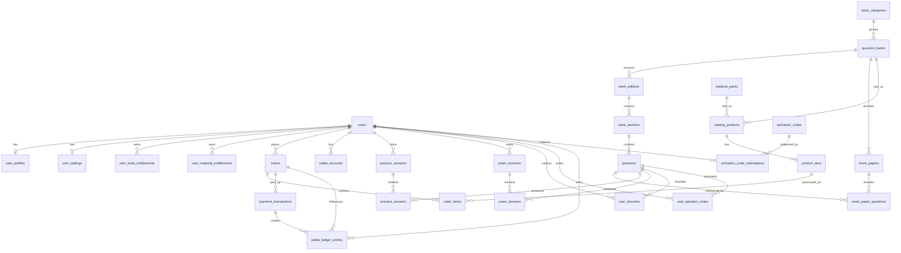

# 刷题小程序 - 系统架构文档

## 1. 系统概述

本系统是一个面向微信用户的在线刷题练习平台，包含三个核心部分：

| 组成部分 | 技术栈 | 说明 |
|---------|--------|------|
| 用户端 | 微信小程序 (TypeScript + Less + Glass-easel) | 面向用户的答题、刷题界面 |
| 管理后台 | Next.js + shadcn/ui | 题库管理、用户管理、数据统计 |
| 基础设施 | 腾讯云 EdgeOne Pages + PostgreSQL | 静态托管、边缘计算、数据存储 |

## 2. 整体架构

```
┌──────────────────────────────────────────────────────────────┐
│                         用户侧                                │
│                                                              │
│   ┌──────────────┐              ┌──────────────────────┐     │
│   │  微信小程序    │  ──HTTP──▶  │  EdgeOne Pages (API)  │     │
│   │  (刷题/答题)  │  ◀─JSON───  │  Next.js Serverless   │     │
│   └──────────────┘              └──────────┬───────────┘     │
│                                            │                 │
│   ┌──────────────┐                         │                 │
│   │  管理后台      │  ──HTTP──▶  ┌──────────▼───────────┐    │
│   │  Next.js +    │             │  腾讯云 PostgreSQL     │    │
│   │  shadcn/ui    │             │  (题库/用户/记录)       │    │
│   └──────────────┘             └──────────────────────┘     │
│                                                              │
└──────────────────────────────────────────────────────────────┘

                    ┌─────────────────────┐
                    │   微信开放平台        │
                    │   (登录/支付/分享)    │
                    └─────────────────────┘
```

## 3. 技术栈详情

### 3.1 用户端 - 微信小程序

| 项目 | 选型 | 说明 |
|------|------|------|
| 语言 | TypeScript | 类型安全，提升开发效率 |
| 样式 | Less | 支持嵌套、变量、混入 |
| 组件框架 | Glass-easel | 微信新一代渲染框架 |
| 渲染引擎 | Skyline | 更高性能的渲染方案 |
| 状态管理 | 原生 setData + 自定义 Store | 轻量级，按需选择 |

### 3.2 管理后台 - Next.js + shadcn/ui

| 项目 | 选型 | 说明 |
|------|------|------|
| 框架 | Next.js (App Router) | SSR/SSG + Serverless Functions |
| UI 组件库 | shadcn/ui | 可定制、无运行时依赖 |
| 样式方案 | Tailwind CSS | 与 shadcn/ui 配合 |
| 表单校验 | Zod + React Hook Form | 类型安全的表单处理 |
| 数据表格 | TanStack Table | 题库列表、用户数据展示 |
| 认证 | NextAuth.js | 管理员登录鉴权 |

### 3.3 基础设施 - 腾讯云

| 项目 | 选型 | 说明 |
|------|------|------|
| 托管平台 | EdgeOne Pages | 边缘节点部署，低延迟 |
| 数据库 | 腾讯云 PostgreSQL | 托管关系型数据库，自动备份 |
| CDN | EdgeOne 内置 | 静态资源加速 |
| 域名 & SSL | EdgeOne 内置 | 自动 HTTPS |

## 4. 数据库设计

### 4.1 设计目标

基于原型图，系统已经不是单纯的“题库 + 做题记录”模型，而是一个包含以下域的交易型学习产品：

1. 题库内容域: 首页分类、题库列表、卷册、章节、试题、模拟卷。
2. 用户学习域: 顺序/随机/章节练习、模考、收藏、笔记、学习轨迹、练习历史。
3. 商品与授权域: 题库商品、资料包商品、开通时长、用户已购题库、资料包领取。
4. 钱包支付域: 余额充值、账单明细、订单、微信支付、钱包支付、激活码兑换。
5. 用户偏好域: 当前题库、考试日期、随机题数、自动下一题、夜间模式等设置。

因此数据库建议按“内容模型”和“交易模型”拆开，所有前台页面都围绕 `catalog + entitlement + learning_record + payment` 四条主线组织。

### 4.2 ER 关系图



### 4.3 逻辑分层与核心实体

| 业务域 | 核心表 | 说明 |
|------|------|------|
| 用户 | `users`, `user_profiles`, `user_settings` | 微信身份、展示信息、做题偏好与考试目标 |
| 题库内容 | `bank_categories`, `question_banks`, `bank_editions`, `bank_sections`, `questions` | 首页 tab、卷册、章节树、题目内容 |
| 模考 | `mock_papers`, `mock_paper_questions`, `exam_sessions`, `exam_answers` | 模拟考试入口、模考记录与成绩 |
| 学习记录 | `practice_sessions`, `practice_answers`, `user_favorites`, `user_question_notes` | 章节练习、随机练习、收藏、笔记 |
| 商品与权限 | `catalog_products`, `product_skus`, `user_bank_entitlements`, `material_packs`, `user_material_entitlements` | 开通题库、资料包领取、时长控制 |
| 交易 | `orders`, `order_items`, `payment_transactions`, `wallet_accounts`, `wallet_ledger_entries` | 订单、支付、余额、账单 |
| 营销 | `activation_codes`, `activation_code_redemptions` | 激活码兑换与失败校验 |

### 4.4 推荐 Schema

#### 用户与偏好

```sql
CREATE TABLE users (
    id                  BIGSERIAL PRIMARY KEY,
    openid              VARCHAR(64) NOT NULL UNIQUE,
    union_id            VARCHAR(64),
    mobile              VARCHAR(32),
    status              VARCHAR(16) NOT NULL DEFAULT 'active',
    created_at          TIMESTAMPTZ NOT NULL DEFAULT NOW(),
    updated_at          TIMESTAMPTZ NOT NULL DEFAULT NOW()
);

CREATE TABLE user_profiles (
    user_id             BIGINT PRIMARY KEY REFERENCES users(id) ON DELETE CASCADE,
    nickname            VARCHAR(64),
    avatar_url          TEXT,
    gender              SMALLINT,
    province            VARCHAR(64),
    city                VARCHAR(64),
    last_login_at       TIMESTAMPTZ,
    last_login_ip       INET
);

CREATE TABLE user_settings (
    user_id                     BIGINT PRIMARY KEY REFERENCES users(id) ON DELETE CASCADE,
    current_bank_id             BIGINT,
    exam_date                   DATE,
    random_question_count       INT NOT NULL DEFAULT 20,
    is_night_mode               BOOLEAN NOT NULL DEFAULT FALSE,
    auto_next_question          BOOLEAN NOT NULL DEFAULT TRUE,
    auto_save_wrong_question    BOOLEAN NOT NULL DEFAULT TRUE,
    retry_wrong_limit           INT NOT NULL DEFAULT 100,
    question_font_scale         NUMERIC(4,2) NOT NULL DEFAULT 1.00,
    question_layout_mode        VARCHAR(16) NOT NULL DEFAULT 'smart',
    video_http_play_enabled     BOOLEAN NOT NULL DEFAULT FALSE,
    video_autoplay_next         BOOLEAN NOT NULL DEFAULT TRUE,
    video_seek_step_seconds     INT NOT NULL DEFAULT 15,
    updated_at                  TIMESTAMPTZ NOT NULL DEFAULT NOW()
);
```

#### 题库内容

```sql
CREATE TABLE bank_categories (
    id                  BIGSERIAL PRIMARY KEY,
    code                VARCHAR(32) NOT NULL UNIQUE,
    name                VARCHAR(64) NOT NULL,
    sort_order          INT NOT NULL DEFAULT 0,
    is_visible          BOOLEAN NOT NULL DEFAULT TRUE
);

CREATE TABLE question_banks (
    id                  BIGSERIAL PRIMARY KEY,
    category_id         BIGINT NOT NULL REFERENCES bank_categories(id),
    code                VARCHAR(64) NOT NULL UNIQUE,
    name                VARCHAR(128) NOT NULL,
    subtitle            VARCHAR(255),
    cover_url           TEXT,
    description         TEXT,
    status              VARCHAR(16) NOT NULL DEFAULT 'draft',
    sale_type           VARCHAR(16) NOT NULL DEFAULT 'paid',
    default_valid_days  INT,
    sort_order          INT NOT NULL DEFAULT 0,
    is_recommended      BOOLEAN NOT NULL DEFAULT FALSE,
    created_at          TIMESTAMPTZ NOT NULL DEFAULT NOW(),
    updated_at          TIMESTAMPTZ NOT NULL DEFAULT NOW()
);

CREATE TABLE bank_editions (
    id                  BIGSERIAL PRIMARY KEY,
    bank_id             BIGINT NOT NULL REFERENCES question_banks(id) ON DELETE CASCADE,
    name                VARCHAR(128) NOT NULL,
    version_label       VARCHAR(64),
    sort_order          INT NOT NULL DEFAULT 0,
    is_trial            BOOLEAN NOT NULL DEFAULT FALSE,
    is_active           BOOLEAN NOT NULL DEFAULT TRUE
);

CREATE TABLE bank_sections (
    id                  BIGSERIAL PRIMARY KEY,
    edition_id          BIGINT NOT NULL REFERENCES bank_editions(id) ON DELETE CASCADE,
    parent_id           BIGINT REFERENCES bank_sections(id),
    title               VARCHAR(255) NOT NULL,
    section_type        VARCHAR(16) NOT NULL DEFAULT 'chapter',
    sort_order          INT NOT NULL DEFAULT 0,
    question_count      INT NOT NULL DEFAULT 0,
    is_trial            BOOLEAN NOT NULL DEFAULT FALSE
);

CREATE TABLE questions (
    id                  BIGSERIAL PRIMARY KEY,
    bank_id             BIGINT NOT NULL REFERENCES question_banks(id),
    section_id          BIGINT REFERENCES bank_sections(id),
    question_type       VARCHAR(16) NOT NULL,
    stem                TEXT NOT NULL,
    options             JSONB,
    correct_answer      JSONB NOT NULL,
    explanation         TEXT,
    difficulty          SMALLINT NOT NULL DEFAULT 1,
    source_label        VARCHAR(128),
    sort_order          INT NOT NULL DEFAULT 0,
    status              VARCHAR(16) NOT NULL DEFAULT 'published',
    created_at          TIMESTAMPTZ NOT NULL DEFAULT NOW(),
    updated_at          TIMESTAMPTZ NOT NULL DEFAULT NOW()
);

CREATE INDEX idx_questions_bank_section ON questions(bank_id, section_id, sort_order);
```

#### 模考与练习

```sql
CREATE TABLE mock_papers (
    id                  BIGSERIAL PRIMARY KEY,
    bank_id             BIGINT NOT NULL REFERENCES question_banks(id) ON DELETE CASCADE,
    title               VARCHAR(255) NOT NULL,
    paper_year          INT,
    total_questions     INT NOT NULL,
    total_score         INT NOT NULL,
    passing_score       INT,
    duration_minutes    INT NOT NULL,
    status              VARCHAR(16) NOT NULL DEFAULT 'published',
    created_at          TIMESTAMPTZ NOT NULL DEFAULT NOW()
);

CREATE TABLE mock_paper_questions (
    paper_id            BIGINT NOT NULL REFERENCES mock_papers(id) ON DELETE CASCADE,
    question_id         BIGINT NOT NULL REFERENCES questions(id),
    sort_order          INT NOT NULL,
    score               NUMERIC(8,2) NOT NULL DEFAULT 1,
    PRIMARY KEY (paper_id, question_id)
);

CREATE TABLE practice_sessions (
    id                  BIGSERIAL PRIMARY KEY,
    user_id             BIGINT NOT NULL REFERENCES users(id),
    bank_id             BIGINT NOT NULL REFERENCES question_banks(id),
    section_id          BIGINT REFERENCES bank_sections(id),
    mode                VARCHAR(16) NOT NULL, -- sequential/random/chapter/wrong-book
    started_at          TIMESTAMPTZ NOT NULL DEFAULT NOW(),
    ended_at            TIMESTAMPTZ,
    question_count      INT NOT NULL DEFAULT 0,
    correct_count       INT NOT NULL DEFAULT 0
);

CREATE TABLE practice_answers (
    id                  BIGSERIAL PRIMARY KEY,
    session_id          BIGINT NOT NULL REFERENCES practice_sessions(id) ON DELETE CASCADE,
    user_id             BIGINT NOT NULL REFERENCES users(id),
    question_id         BIGINT NOT NULL REFERENCES questions(id),
    answer              JSONB,
    is_correct          BOOLEAN NOT NULL,
    used_ms             INT,
    is_favorited        BOOLEAN NOT NULL DEFAULT FALSE,
    created_at          TIMESTAMPTZ NOT NULL DEFAULT NOW(),
    UNIQUE (session_id, question_id)
);

CREATE TABLE exam_sessions (
    id                  BIGSERIAL PRIMARY KEY,
    user_id             BIGINT NOT NULL REFERENCES users(id),
    paper_id            BIGINT NOT NULL REFERENCES mock_papers(id),
    status              VARCHAR(16) NOT NULL DEFAULT 'in_progress',
    started_at          TIMESTAMPTZ NOT NULL DEFAULT NOW(),
    submitted_at        TIMESTAMPTZ,
    duration_seconds    INT NOT NULL DEFAULT 0,
    score               NUMERIC(8,2),
    correct_count       INT,
    total_questions     INT NOT NULL
);

CREATE TABLE exam_answers (
    id                  BIGSERIAL PRIMARY KEY,
    exam_session_id     BIGINT NOT NULL REFERENCES exam_sessions(id) ON DELETE CASCADE,
    question_id         BIGINT NOT NULL REFERENCES questions(id),
    answer              JSONB,
    is_correct          BOOLEAN,
    score               NUMERIC(8,2),
    created_at          TIMESTAMPTZ NOT NULL DEFAULT NOW(),
    UNIQUE (exam_session_id, question_id)
);
```

#### 收藏、笔记、资料包

```sql
CREATE TABLE user_favorites (
    user_id             BIGINT NOT NULL REFERENCES users(id) ON DELETE CASCADE,
    question_id         BIGINT NOT NULL REFERENCES questions(id) ON DELETE CASCADE,
    created_at          TIMESTAMPTZ NOT NULL DEFAULT NOW(),
    PRIMARY KEY (user_id, question_id)
);

CREATE TABLE user_question_notes (
    id                  BIGSERIAL PRIMARY KEY,
    user_id             BIGINT NOT NULL REFERENCES users(id) ON DELETE CASCADE,
    question_id         BIGINT NOT NULL REFERENCES questions(id) ON DELETE CASCADE,
    content             TEXT NOT NULL,
    created_at          TIMESTAMPTZ NOT NULL DEFAULT NOW(),
    updated_at          TIMESTAMPTZ NOT NULL DEFAULT NOW(),
    UNIQUE (user_id, question_id)
);

CREATE TABLE material_packs (
    id                  BIGSERIAL PRIMARY KEY,
    bank_id             BIGINT REFERENCES question_banks(id),
    name                VARCHAR(255) NOT NULL,
    cover_url           TEXT,
    description         TEXT,
    delivery_type       VARCHAR(16) NOT NULL DEFAULT 'download',
    status              VARCHAR(16) NOT NULL DEFAULT 'published',
    created_at          TIMESTAMPTZ NOT NULL DEFAULT NOW()
);

CREATE TABLE user_material_entitlements (
    id                  BIGSERIAL PRIMARY KEY,
    user_id             BIGINT NOT NULL REFERENCES users(id),
    material_pack_id    BIGINT NOT NULL REFERENCES material_packs(id),
    source_type         VARCHAR(16) NOT NULL, -- purchase/gift/redeem
    source_ref_id       BIGINT,
    granted_at          TIMESTAMPTZ NOT NULL DEFAULT NOW(),
    expired_at          TIMESTAMPTZ,
    UNIQUE (user_id, material_pack_id)
);
```

#### 商品、订单、授权与钱包

```sql
CREATE TABLE catalog_products (
    id                  BIGSERIAL PRIMARY KEY,
    product_type        VARCHAR(16) NOT NULL, -- bank/material
    ref_id              BIGINT NOT NULL,
    title               VARCHAR(255) NOT NULL,
    cover_url           TEXT,
    selling_points      JSONB,
    status              VARCHAR(16) NOT NULL DEFAULT 'active',
    created_at          TIMESTAMPTZ NOT NULL DEFAULT NOW()
);

CREATE TABLE product_skus (
    id                  BIGSERIAL PRIMARY KEY,
    product_id          BIGINT NOT NULL REFERENCES catalog_products(id) ON DELETE CASCADE,
    sku_code            VARCHAR(64) NOT NULL UNIQUE,
    title               VARCHAR(128) NOT NULL,
    price_fen           INT NOT NULL,
    original_price_fen  INT,
    validity_days       INT,
    wallet_pay_enabled  BOOLEAN NOT NULL DEFAULT TRUE,
    wechat_pay_enabled  BOOLEAN NOT NULL DEFAULT TRUE,
    activation_enabled  BOOLEAN NOT NULL DEFAULT TRUE,
    status              VARCHAR(16) NOT NULL DEFAULT 'active'
);

CREATE TABLE user_bank_entitlements (
    id                  BIGSERIAL PRIMARY KEY,
    user_id             BIGINT NOT NULL REFERENCES users(id),
    bank_id             BIGINT NOT NULL REFERENCES question_banks(id),
    source_type         VARCHAR(16) NOT NULL, -- purchase/trial/redeem/admin
    source_ref_id       BIGINT,
    granted_at          TIMESTAMPTZ NOT NULL DEFAULT NOW(),
    starts_at           TIMESTAMPTZ NOT NULL DEFAULT NOW(),
    expires_at          TIMESTAMPTZ,
    status              VARCHAR(16) NOT NULL DEFAULT 'active',
    UNIQUE (user_id, bank_id, source_type, source_ref_id)
);

CREATE TABLE orders (
    id                  BIGSERIAL PRIMARY KEY,
    order_no            VARCHAR(32) NOT NULL UNIQUE,
    user_id             BIGINT NOT NULL REFERENCES users(id),
    order_type          VARCHAR(16) NOT NULL, -- bank/material/recharge
    status              VARCHAR(16) NOT NULL DEFAULT 'pending',
    total_amount_fen    INT NOT NULL,
    pay_amount_fen      INT NOT NULL,
    currency            CHAR(3) NOT NULL DEFAULT 'CNY',
    expired_at          TIMESTAMPTZ,
    paid_at             TIMESTAMPTZ,
    cancelled_at        TIMESTAMPTZ,
    created_at          TIMESTAMPTZ NOT NULL DEFAULT NOW()
);

CREATE TABLE order_items (
    id                  BIGSERIAL PRIMARY KEY,
    order_id            BIGINT NOT NULL REFERENCES orders(id) ON DELETE CASCADE,
    product_id          BIGINT NOT NULL REFERENCES catalog_products(id),
    sku_id              BIGINT NOT NULL REFERENCES product_skus(id),
    quantity            INT NOT NULL DEFAULT 1,
    unit_price_fen      INT NOT NULL,
    total_price_fen     INT NOT NULL,
    snapshot            JSONB NOT NULL
);

CREATE TABLE payment_transactions (
    id                  BIGSERIAL PRIMARY KEY,
    order_id            BIGINT NOT NULL REFERENCES orders(id) ON DELETE CASCADE,
    user_id             BIGINT NOT NULL REFERENCES users(id),
    payment_method      VARCHAR(16) NOT NULL, -- wechat/wallet/code
    status              VARCHAR(16) NOT NULL DEFAULT 'pending',
    amount_fen          INT NOT NULL,
    provider_trade_no   VARCHAR(64),
    provider_payload    JSONB,
    paid_at             TIMESTAMPTZ,
    created_at          TIMESTAMPTZ NOT NULL DEFAULT NOW()
);

CREATE TABLE wallet_accounts (
    user_id             BIGINT PRIMARY KEY REFERENCES users(id) ON DELETE CASCADE,
    balance_fen         INT NOT NULL DEFAULT 0,
    frozen_fen          INT NOT NULL DEFAULT 0,
    updated_at          TIMESTAMPTZ NOT NULL DEFAULT NOW()
);

CREATE TABLE wallet_ledger_entries (
    id                  BIGSERIAL PRIMARY KEY,
    user_id             BIGINT NOT NULL REFERENCES users(id),
    entry_type          VARCHAR(16) NOT NULL, -- recharge/debit/refund/adjust
    direction           VARCHAR(8) NOT NULL,  -- in/out
    amount_fen          INT NOT NULL,
    balance_after_fen   INT NOT NULL,
    order_id            BIGINT REFERENCES orders(id),
    payment_txn_id      BIGINT REFERENCES payment_transactions(id),
    remark              VARCHAR(255),
    created_at          TIMESTAMPTZ NOT NULL DEFAULT NOW()
);

CREATE INDEX idx_wallet_ledger_user_created ON wallet_ledger_entries(user_id, created_at DESC);
```

#### 激活码兑换

```sql
CREATE TABLE activation_codes (
    id                  BIGSERIAL PRIMARY KEY,
    code                VARCHAR(64) NOT NULL UNIQUE,
    sku_id              BIGINT NOT NULL REFERENCES product_skus(id),
    batch_no            VARCHAR(64),
    status              VARCHAR(16) NOT NULL DEFAULT 'unused',
    expires_at          TIMESTAMPTZ,
    redeemed_by_user_id BIGINT REFERENCES users(id),
    redeemed_at         TIMESTAMPTZ,
    created_at          TIMESTAMPTZ NOT NULL DEFAULT NOW()
);

CREATE TABLE activation_code_redemptions (
    id                  BIGSERIAL PRIMARY KEY,
    activation_code_id  BIGINT NOT NULL REFERENCES activation_codes(id),
    user_id             BIGINT NOT NULL REFERENCES users(id),
    order_id            BIGINT REFERENCES orders(id),
    result              VARCHAR(16) NOT NULL, -- success/invalid/expired/used
    created_at          TIMESTAMPTZ NOT NULL DEFAULT NOW()
);
```

### 4.5 状态与约束建议

| 对象 | 建议状态 |
|------|------|
| `question_banks.status` | `draft / published / archived` |
| `orders.status` | `pending / paid / cancelled / closed / refunded` |
| `payment_transactions.status` | `pending / success / failed / closed` |
| `user_bank_entitlements.status` | `active / expired / revoked` |
| `activation_codes.status` | `unused / redeemed / expired / disabled` |
| `exam_sessions.status` | `in_progress / submitted / expired` |

关键约束：

1. 订单、支付、发放权限必须解耦，避免“支付成功即视为发放成功”的单表设计。
2. 钱包余额只能由 `wallet_ledger_entries` 驱动，`wallet_accounts.balance_fen` 只是汇总快照。
3. 题库授权与资料包授权独立建模，避免后续课程/班级商品复用时结构失真。
4. 章节树用 `bank_sections.parent_id` 支撑“卷册/章节/试卷”多层级，而不是把结构塞进 JSON。
5. 模考记录与章节练习记录拆表，避免在一张 `practice_records` 上堆模式分支。

### 4.6 索引与分区建议

| 表 | 索引建议 | 原因 |
|------|------|------|
| `orders` | `(user_id, created_at desc)`, `order_no unique` | 我的订单、订单详情、支付回查 |
| `payment_transactions` | `(order_id)`, `(provider_trade_no)` | 支付回调幂等 |
| `practice_answers` | `(user_id, created_at desc)`, `(question_id)` | 练习历史、错题重练 |
| `exam_sessions` | `(user_id, started_at desc)` | 模考记录 |
| `user_bank_entitlements` | `(user_id, bank_id, status)` | 判断是否已开通题库 |
| `activation_codes` | `(code unique)`, `(status, expires_at)` | 激活码校验 |
| `questions` | `(bank_id, section_id, sort_order)` | 章节练习、顺序取题 |

当 `practice_answers`、`wallet_ledger_entries`、`payment_transactions` 进入百万级后，建议按 `created_at` 做月分区。

## 5. API 设计

### 5.1 API 设计原则

1. 小程序前台统一走 `/api/v1`，管理后台走 `/api/admin/v1`。
2. 登录后使用 Bearer Token；支付回调、微信服务器回调单独走签名校验。
3. 列表接口全部支持分页；状态型操作必须幂等。
4. 是否已开通题库、是否可试用、是否可支付，不靠前端拼规则，统一由后端返回。

### 5.2 统一响应格式

```json
{
  "code": 0,
  "message": "ok",
  "data": {},
  "requestId": "req_xxx"
}
```

分页结构：

```json
{
  "code": 0,
  "data": {
    "items": [],
    "page": 1,
    "pageSize": 20,
    "total": 100
  }
}
```

### 5.3 小程序端 REST API

基础路径: `/api/v1`

#### 认证与用户

| 方法 | 路径 | 说明 |
|------|------|------|
| POST | `/auth/login` | 微信 `code` 登录，返回 token、用户信息、当前设置 |
| GET | `/me` | 获取我的 FOCO 首页数据摘要 |
| PATCH | `/me/profile` | 更新昵称、头像等资料 |
| GET | `/me/settings` | 获取做题与播放设置 |
| PATCH | `/me/settings` | 更新当前题库、考试日期、随机题数、自动下一题等 |

#### 首页、分类、题库目录

| 方法 | 路径 | 说明 |
|------|------|------|
| GET | `/home` | 首页聚合数据，返回 banner、题库分类、推荐题库、资料包入口 |
| GET | `/bank-categories` | 获取首页一级分类 tab |
| GET | `/bank-categories/:categoryId/banks` | 获取某分类下题库列表，支持综合/销量/最新/价格排序 |
| GET | `/banks/:bankId` | 题库详情，返回价格、是否开通、卷册数、题量、试用范围 |
| GET | `/banks/:bankId/editions` | 题库下卷册/版本列表 |
| GET | `/banks/:bankId/sections` | 获取章节树，支持 `trialOnly=true` |
| GET | `/banks/:bankId/entitlement` | 查询当前用户对该题库的授权状态 |

#### 练习与题目

| 方法 | 路径 | 说明 |
|------|------|------|
| POST | `/practice-sessions` | 创建练习会话，模式支持 `chapter/random/sequential/wrong-book` |
| GET | `/practice-sessions/:sessionId` | 获取练习会话摘要 |
| GET | `/practice-sessions/:sessionId/questions/:questionId` | 拉取单题详情 |
| POST | `/practice-sessions/:sessionId/answers` | 提交/覆盖某题答案 |
| POST | `/practice-sessions/:sessionId/complete` | 结束本次练习并结算统计 |
| GET | `/practice-history` | 练习历史列表 |
| GET | `/wrong-questions` | 错题集列表，支持按题库过滤 |

#### 收藏、笔记、草稿纸

| 方法 | 路径 | 说明 |
|------|------|------|
| GET | `/favorites` | 收藏题目列表 |
| PUT | `/questions/:questionId/favorite` | 收藏/取消收藏 |
| GET | `/questions/:questionId/note` | 获取该题笔记 |
| PUT | `/questions/:questionId/note` | 保存或更新笔记 |

#### 模拟考试

| 方法 | 路径 | 说明 |
|------|------|------|
| GET | `/banks/:bankId/mock-papers` | 获取某题库可用模考试卷 |
| POST | `/mock-papers/:paperId/exam-sessions` | 开始模考 |
| GET | `/exam-sessions/:examSessionId` | 获取模考进度与剩余时间 |
| POST | `/exam-sessions/:examSessionId/answers` | 保存模考答题进度 |
| POST | `/exam-sessions/:examSessionId/submit` | 交卷并返回成绩 |
| GET | `/mock-papers/:paperId/exam-sessions` | 获取某试卷的模考记录 |

#### 学习轨迹与统计

| 方法 | 路径 | 说明 |
|------|------|------|
| GET | `/learning/records` | 学习记录流 |
| GET | `/learning/stats/overview` | 学习统计概览 |
| GET | `/learning/stats/calendar` | 学习日历热力图数据 |
| GET | `/learning/stats/banks/:bankId` | 单题库统计 |

#### 商品、订单、支付、钱包

| 方法 | 路径 | 说明 |
|------|------|------|
| GET | `/products/banks/:bankId` | 题库商品页数据，返回 SKU、原价、现价、支付方式 |
| POST | `/orders` | 创建订单，支持 `bank/material/recharge` |
| GET | `/orders` | 我的订单列表，支持 `pending/paid/cancelled/all` |
| GET | `/orders/:orderId` | 订单详情 |
| POST | `/orders/:orderId/cancel` | 取消待支付订单 |
| POST | `/orders/:orderId/payments/wechat` | 创建微信支付参数 |
| POST | `/orders/:orderId/payments/wallet` | 使用钱包余额支付 |
| POST | `/orders/:orderId/payments/activation-code` | 使用激活码兑换并支付 |
| GET | `/wallet` | 钱包余额、可用充值档位 |
| POST | `/wallet/recharge-orders` | 创建充值订单 |
| GET | `/wallet/ledger` | 账单明细 |
| POST | `/activation-codes/redeem` | 直接兑换激活码并返回结果 |

#### 资料包、客服与静态协议

| 方法 | 路径 | 说明 |
|------|------|------|
| GET | `/material-packs` | 我的资料包列表 |
| GET | `/material-packs/:packId` | 资料包详情与下载/查看入口 |
| GET | `/support/contact` | 客服二维码、客服文案、服务时间 |
| GET | `/content/about` | 关于我们 |
| GET | `/content/user-agreement` | 用户协议 |
| GET | `/content/privacy-policy` | 隐私政策 |

### 5.4 关键接口示例

#### 创建题库订单

`POST /api/v1/orders`

```json
{
  "orderType": "bank",
  "items": [
    {
      "productId": 1001,
      "skuId": 2001,
      "quantity": 1
    }
  ]
}
```

返回：

```json
{
  "code": 0,
  "data": {
    "orderId": 90001,
    "orderNo": "202604280850372099253",
    "status": "pending",
    "payAmountFen": 48800,
    "expiresAt": "2026-04-28T09:05:37+08:00"
  }
}
```

#### 激活码兑换

`POST /api/v1/activation-codes/redeem`

```json
{
  "code": "ABCDEF-123456"
}
```

成功时返回授权信息；失败时 `message` 对应原型里的“验证码无效 / 已使用 / 已过期”。

#### 更新用户设置

`PATCH /api/v1/me/settings`

```json
{
  "currentBankId": 153,
  "examDate": "2026-03-09",
  "randomQuestionCount": 20,
  "autoNextQuestion": true,
  "isNightMode": false
}
```

### 5.5 管理后台 API

基础路径: `/api/admin/v1`

#### 题库与内容管理

| 方法 | 路径 | 说明 |
|------|------|------|
| GET/POST | `/banks` | 题库列表、创建题库 |
| GET/PATCH/DELETE | `/banks/:bankId` | 题库详情、编辑、归档 |
| GET/POST | `/banks/:bankId/editions` | 卷册/版本管理 |
| GET/POST | `/editions/:editionId/sections` | 章节树管理 |
| GET/POST | `/banks/:bankId/questions` | 题目列表、单题创建 |
| POST | `/banks/:bankId/questions/import` | Excel/JSON 批量导入题目 |
| GET/POST | `/banks/:bankId/mock-papers` | 模考试卷管理 |

#### 商品、营销与支付配置

| 方法 | 路径 | 说明 |
|------|------|------|
| GET/POST | `/products` | 商品/SPU 管理 |
| GET/POST | `/products/:productId/skus` | SKU、价格、有效期管理 |
| GET/POST | `/activation-code-batches` | 激活码批次生成 |
| GET | `/activation-codes` | 激活码查询与核销记录 |
| GET/PATCH | `/payment-settings` | 微信支付、钱包支付开关配置 |

#### 用户与交易

| 方法 | 路径 | 说明 |
|------|------|------|
| GET | `/users` | 用户列表 |
| GET | `/users/:userId` | 用户详情、授权、余额、学习概览 |
| POST | `/users/:userId/entitlements` | 人工补发题库/资料包授权 |
| GET | `/orders` | 后台订单列表 |
| GET | `/wallet-ledger` | 充值与扣款流水 |

#### 统计

| 方法 | 路径 | 说明 |
|------|------|------|
| GET | `/dashboard/overview` | GMV、付费用户、充值、活跃数据 |
| GET | `/dashboard/learning` | 做题量、模考量、题库活跃度 |
| GET | `/dashboard/products` | 题库销量、激活码使用率 |

### 5.6 回调与幂等

| 方法 | 路径 | 说明 |
|------|------|------|
| POST | `/api/callbacks/wechat/pay` | 微信支付回调，按 `provider_trade_no` 幂等更新订单 |
| POST | `/api/callbacks/wechat/refund` | 退款结果回调 |

幂等要求：

1. 创建支付单前校验订单状态必须仍为 `pending`。
2. 支付回调落库后先写 `payment_transactions`，再异步发放题库/资料包权限。
3. 激活码兑换必须用事务锁定 `activation_codes` 记录，避免并发重复兑换。

## 6. 项目目录结构

```
hello-world/
├── miniprogram/                     # 微信小程序 (用户端)
│   ├── app.ts / app.json / app.less
│   ├── components/                  # 公共组件
│   │   ├── navigation-bar/
│   │   ├── question-card/           # 题目卡片组件
│   │   └── answer-sheet/            # 答题卡组件
│   ├── pages/
│   │   ├── index/                   # 首页 (题库列表)
│   │   ├── practice/                # 答题页
│   │   ├── result/                  # 答题结果页
│   │   ├── favorites/               # 收藏页
│   │   ├── stats/                   # 统计页
│   │   └── profile/                 # 个人中心
│   ├── services/                    # API 请求封装
│   ├── store/                       # 状态管理
│   └── utils/                       # 工具函数
│
├── admin/                           # 管理后台 (Next.js)
│   ├── app/                         # App Router
│   │   ├── layout.tsx
│   │   ├── page.tsx                 # 仪表盘
│   │   ├── banks/                   # 题库管理页
│   │   ├── questions/               # 题目管理页
│   │   ├── users/                   # 用户管理页
│   │   └── api/                     # API Routes
│   │       ├── v1/                  # 小程序端 API
│   │       └── admin/               # 管理端 API
│   ├── components/                  # shadcn/ui 组件
│   ├── lib/
│   │   ├── db.ts                    # 数据库连接
│   │   └── auth.ts                  # 鉴权逻辑
│   ├── package.json
│   └── next.config.ts
│
├── docs/                            # 文档
│   └── ARCHITECTURE.md              # 本文件
│
├── package.json                     # 小程序依赖
└── tsconfig.json
```

## 7. 部署架构

```
┌────────────────────────────────────────────────────────────┐
│                     腾讯云 EdgeOne                          │
│                                                            │
│   ┌────────────────────┐    ┌────────────────────────┐    │
│   │  EdgeOne Pages      │    │  EdgeOne CDN            │    │
│   │                    │    │                        │    │
│   │  /admin/* ──────▶  │    │  静态资源缓存           │    │
│   │  Next.js SSR/SSG   │    │  图片/字体/JS/CSS       │    │
│   │                    │    │                        │    │
│   │  /api/* ────────▶  │    └────────────────────────┘    │
│   │  Serverless Funcs  │                                    │
│   └────────┬───────────┘                                    │
│            │                                                │
│            │  内网连接                                       │
│            ▼                                                │
│   ┌────────────────────┐                                   │
│   │  腾讯云 PostgreSQL  │                                   │
│   │                    │                                   │
│   │  - 主从高可用       │                                   │
│   │  - 自动备份         │                                   │
│   │  - 连接池           │                                   │
│   └────────────────────┘                                   │
│                                                            │
└────────────────────────────────────────────────────────────┘
         │
         │  HTTPS
         ▼
┌────────────────────┐
│  微信小程序客户端   │
│  (用户刷题)        │
└────────────────────┘
```

### 部署流程

1. **管理后台部署**: `git push` → EdgeOne Pages 自动构建 → Next.js 输出 SSR + Serverless Functions
2. **小程序发布**: 微信开发者工具 → 上传代码 → 提交审核 → 发布
3. **数据库变更**: 管理后台通过 migration 脚本执行

## 8. 认证流程

### 8.1 小程序用户认证

```
小程序                    后端 API                   微信服务器
  │                         │                          │
  │  wx.login()             │                          │
  │────────────────────────▶│                          │
  │      返回 code          │                          │
  │◀────────────────────────│                          │
  │                         │                          │
  │  POST /auth/login       │                          │
  │  { code }               │   jscode2session         │
  │────────────────────────▶│─────────────────────────▶│
  │                         │    { openid, session }   │
  │                         │◀─────────────────────────│
  │                         │                          │
  │                         │  查询/创建 user           │
  │                         │  生成 JWT token           │
  │    { token, userInfo }  │                          │
  │◀────────────────────────│                          │
```

### 8.2 管理后台认证

- 管理员通过账号密码登录 NextAuth.js
- 管理员账号存储在数据库 `admins` 表中
- 支持多管理员角色 (super_admin / admin)

## 9. 核心业务流程

### 9.1 刷题流程

```
用户进入题库列表 → 选择题库 → 选择模式(顺序/随机/考试)
                                    │
                    ┌───────────────┼───────────────┐
                    ▼               ▼               ▼
               顺序刷题         随机刷题         考试模式
               按序加载         随机排序         限时答题
                    │               │               │
                    └───────────────┼───────────────┘
                                    │
                              逐题作答
                              提交答案
                                    │
                              ◀──上一题  下一题──▶
                                    │
                              答完所有题
                                    │
                              查看结果/解析
                                    │
                        ┌───────────┼───────────┐
                        ▼           ▼           ▼
                    错题重练    收藏错题    查看统计
```

## 10. 安全策略

| 层面 | 措施 |
|------|------|
| 传输层 | 全链路 HTTPS，EdgeOne 自动 SSL |
| 认证 | JWT token + 微信 openid 双重校验 |
| 接口 | 管理端 API 强制鉴权，限流防刷 |
| 数据库 | 内网访问，最小权限账号，定期备份 |
| 输入 | 参数校验 (Zod)，SQL 参数化查询 |
| 小程序 | 代码混淆，接口域名白名单 |
